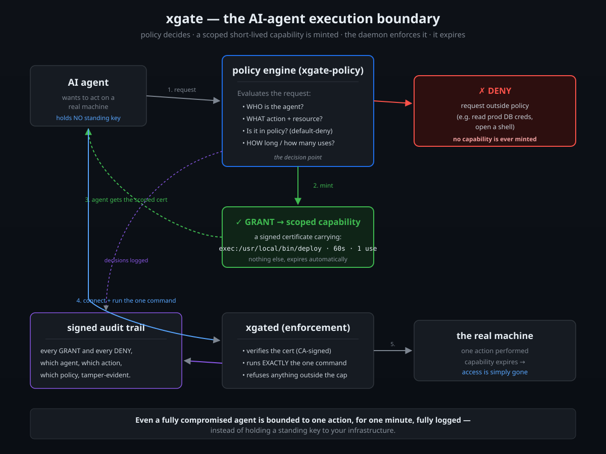
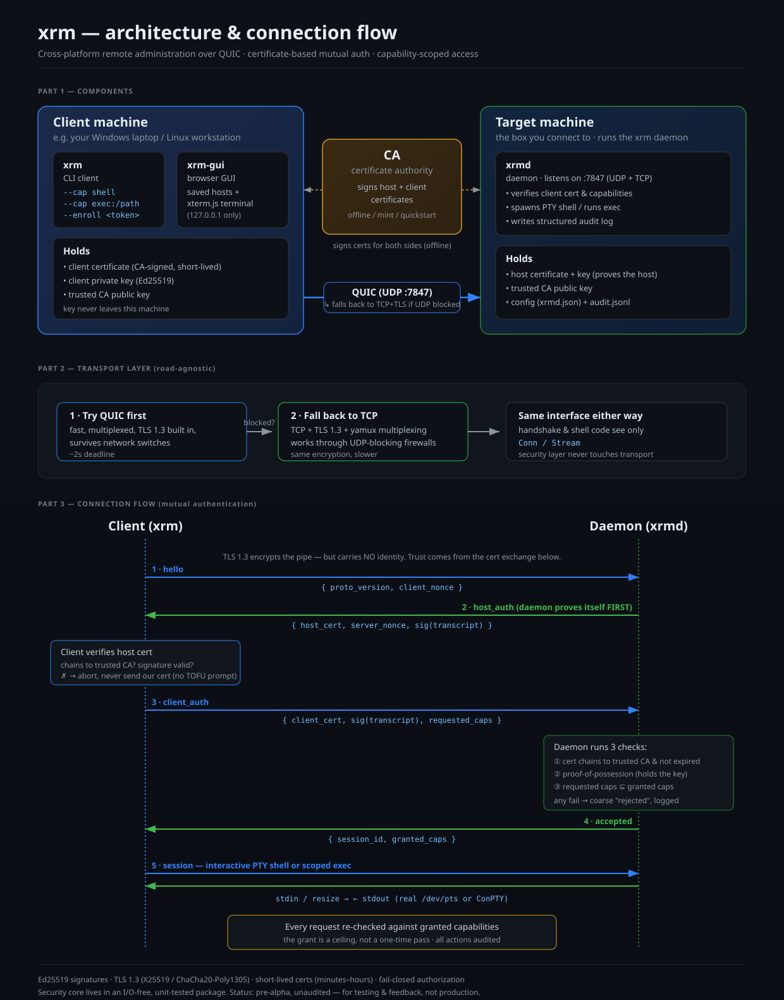

# xgate

**Scoped, ephemeral, audited access for the age of AI agents.**

When an AI agent runs commands on real machines, how do you give it access
*without* handing it a permanent key to your infrastructure? Today the answer is
usually "give it broad standing credentials and hope it behaves" — a bad answer
when the thing holding the key can be prompt-injected, hallucinate, or run
amok.

xgate is a different answer: an agent (or a human, or a CI job) gets a
**certificate that grants exactly one command, on one host, for a few minutes,
fully logged — and then it's gone.** No standing access. No shell to escape
from. A signed audit trail of everything it did.

It's built in Go, runs the same on Linux, macOS, Windows, and Raspberry Pi, and
speaks QUIC (with an automatic TCP fallback).

```
# grant an identity a short-lived, single-command capability:
#   exec:/usr/bin/deploy   — and nothing else, for 15 minutes
# the agent/client connects with a scoped certificate; the daemon enforces it
# on every request and writes a signed audit log.
```

Try the human version across two machines in ~2 minutes — no config files, no
key copying:

```
xgated quickstart          # on the target: prints one enrollment token
xgate  --enroll <token>    # on the client: you're in a scoped session
```

There's also a browser GUI (`xgate-gui`) with a real terminal.

> **Why this matters for AI agents:** the security model agents need —
> least-privilege, time-boxed, revocable-by-expiry, fully audited — is exactly
> what SSH and long-lived keys *can't* give you, and exactly what xgate's
> capability-scoped short-lived certificates *do*. See
> [docs/ai-agents.md](docs/ai-agents.md).

## How the execution boundary works



An agent (or human, or CI job) never holds a standing key. It asks the policy
engine for an action; policy grants a **scoped, short-lived, single-use
certificate** or **denies** it; the daemon enforces exactly that capability and
logs the decision; the capability expires on its own. Even a compromised agent
is bounded to one action. See [docs/limitations.md](docs/limitations.md) for a
full account of how access is limited and what isn't built yet.

## How it works (transport & handshake)



> ## ⚠️ Security status: UNAUDITED — do not use for real access
>
> This is a **proof-of-concept**. It has **not** had a security review. It is a
> remote-access tool, so an undiscovered bug could expose the machines it runs
> on. **Do not use it to manage real or production systems.** It is published
> to learn in the open and to invite review — not for deployment.
>
> A formal security audit is planned. Until it is done and its findings are
> addressed, treat this as educational software only.
>
> **What works** (verified on real hardware): mutual-auth handshake, remote
> command execution, interactive PTY shells in **all three directions**
> (Windows→Linux, Linux→Windows, and same-host), QUIC transport with automatic
> TCP fallback, the CLI, and the browser GUI. **Less tested:** macOS and
> Raspberry Pi runtime, long Windows sessions, and GUI visual polish. See
> [Status](#status).
>
> Please break it — that is what this repo is for.

---

## Why this exists

If you know SSH, three things are different:

- **Credentials expire in minutes, not years.** You hold a keypair, but on its
  own it grants nothing. A certificate authority signs a short-lived
  certificate binding your key to an identity and a set of permissions. When it
  expires there is nothing to revoke.
- **No trust-on-first-use prompt.** The daemon proves its identity with a
  CA-signed certificate *before* the client sends anything. There is no
  `known_hosts`, no fingerprint to click through. An unrecognised host is an
  error.
- **Authorization is per-action, not shell-or-nothing.** A certificate can
  grant exactly `exec:/usr/bin/deploy` and nothing else — no shell to escape
  from — or a full interactive `shell`, each enforced by the daemon.

It is written in Go specifically so one machine can build binaries for every
target with no C toolchain. See [`docs/go-vs-rust.md`](docs/go-vs-rust.md) for
the trade-offs (there is an earlier Rust implementation; this replaced it for
build simplicity).

This is **not** Microsoft WinRM and does not speak to the Windows Remote
Management service. Both machines run `xgated`/`xgate`; it is its own protocol.

---

## Build-in-public — and I want to hear from AI-agent builders

xgate is open source and pre-alpha, published to be tried, broken, reviewed, and
built upon. The direction I'm most interested in is **access control for AI
agents that act on real systems** (see [docs/ai-agents.md](docs/ai-agents.md)).

Specific things that would genuinely help:

- **If you build AI agents that run commands on machines:** tell me how you
  handle their access today, what scares you, and whether per-task, expiring,
  scoped access fits your architecture. This feedback directly shapes the
  project — open an issue or reply to the launch thread.
- **Try it and report what breaks** — especially macOS, Raspberry Pi, or long
  Windows sessions. Open an issue.
- **Review the security design** — if you know cryptographic protocols, the
  handshake in [`proto/proto.go`](proto/proto.go) is the thing to scrutinize.
  No paid audit yet, so expert eyes are the review. See [SECURITY.md](SECURITY.md).
- **Build on it** — the protocol and the `proto` package are documented; clients,
  integrations, and tooling are welcome.

No contribution is too small, including "your setup instructions confused me."

---

## Prerequisites

**To build:**

- **Go 1.23 or newer** — that is the only hard requirement.
- **No C compiler needed.** Everything is pure Go: crypto is the standard
  library, QUIC is [`quic-go`](https://github.com/quic-go/quic-go), PTY/ConPTY
  is [`go-pty`](https://github.com/aymanbagabas/go-pty). This is the whole
  point of choosing Go — `go build` cross-compiles anywhere.

**To run:**

- A **UDP** port reachable between client and daemon (default 7847). QUIC is
  UDP — this trips people up; open the port for UDP, not TCP.
- **Windows daemon only:** Windows 10 1809+ or Server 2019+ (ConPTY requires
  the pseudo-console API).

---

## Build

```bash
git clone https://github.com/expe-rience/xgate.git
cd xgate
go build ./...        # builds xgated, xgate, mint for your platform
go test ./...         # runs the security-core tests
```

The first build fetches dependencies and generates `go.sum` automatically.

Binaries are produced in the module directory. To place them somewhere:

```bash
go build -o bin/xgated ./cmd/xgated
go build -o bin/xgate  ./cmd/xgate
go build -o bin/mint ./cmd/mint
```

### Cross-compile for every platform

From **one machine**, no extra toolchain:

```bash
./build-all.sh        # writes dist/xgate-<os>-<arch> for 7 targets
```

Or a single target:

```bash
CGO_ENABLED=0 GOOS=windows GOARCH=amd64 go build -o xgated.exe ./cmd/xgated
CGO_ENABLED=0 GOOS=darwin  GOARCH=arm64 go build -o xgated     ./cmd/xgated
CGO_ENABLED=0 GOOS=linux   GOARCH=arm   go build -o xgated     ./cmd/xgated  # Raspberry Pi
```

---

## Quick test (2 machines, ~2 minutes)

The fastest way to try it. No config files, no cert juggling.

**Get the binaries:** download from the [Releases page](https://github.com/YOURNAME/xgate/releases)
— pick `xgated` and `xgate` for each machine's OS — or build with `go build ./...`.

**On the machine you want to connect TO** (say, a Linux box):

```
./xgated quickstart
```

It prints three things: a firewall command, a start command, and one
`xgate --enroll <token>` line. Run the firewall command, then the start command.

**On the machine you're connecting FROM** (say, your Windows laptop):

```
xgate --enroll <paste the token here>
```

That's it — you get an interactive shell on the first machine. The token
carries the address, CA key, and a client certificate, so nothing else needs
copying.

> The token is a credential — anyone who has it can connect. Don't paste it
> anywhere public. It's meant for a quick trusted test, not production
> provisioning (in a real deployment the client generates its own key and the
> CA signs it).

## Manual setup (one machine, full control)
## Using it across two machines (both directions)

The same two binaries run everywhere; "direction" is just which machine runs
the daemon. Full setup for **Windows→Linux** and **Linux→Windows** is in
[`docs/interactive-shell.md`](docs/interactive-shell.md), including firewall
commands and the Windows caveats.

---

## Capabilities

Requested with `--cap`, enforced by the daemon on every request:

| `--cap` | Meaning |
|---|---|
| `shell` | Interactive PTY shell |
| `exec:/usr/bin/uptime` | Run exactly this command, no arguments |
| `read:/var/log` | Read files under this path (Unix only — see below) |
| `write:/srv/app` | Write under this path (Unix only) |

A certificate lists which capabilities it grants; requesting more than it
grants is denied, not downgraded. `exec` is per-command — a grant for
`/usr/bin/uptime` cannot run `/bin/sh`.

---

## Transport: QUIC with automatic TCP fallback

The client prefers **QUIC** (fast, UDP-based, multiplexed) and automatically
falls back to **TCP+TLS** when UDP is blocked — common on corporate networks,
hotels, and locked-down firewalls. You don't configure anything; it just
connects.

```bash
xgate --cap shell host:7847                 # auto: QUIC, then TCP if UDP blocked
xgate --transport quic --cap shell host...  # force QUIC
xgate --transport tcp  --cap shell host...  # force the TCP fallback
```

The daemon listens on both roads (UDP and TCP) on the same port simultaneously,
so either kind of client is served. The TCP path uses TLS 1.3 — the same
encryption QUIC uses internally — and [yamux](https://github.com/hashicorp/yamux)
to multiplex streams over the single TCP connection, so interactive shells and
multiple streams work identically on both roads. The client prints which road
it used (`connected via quic` / `connected via tcp`), and the daemon records it
in the audit log.

Trade-off: the TCP fallback loses QUIC's connection-migration and reintroduces
head-of-line blocking, so it is slower for concurrent shell+transfer. It is the
fallback, used only when QUIC can't get through — slower-but-works beats
fast-but-blocked.

## Current limitations

xgate is **pre-alpha and unaudited.** The enforcement layer (scoped, expiring,
audited access) is real and tested; the **policy engine is a proof-of-concept**,
the enrollment token carries the client key (test convenience), there's no rate
limiting or mid-session revocation yet, and file capabilities are unsafe on
Windows. Full honest account — how access is limited *and* every gap — is in
**[docs/limitations.md](docs/limitations.md)**. Do not use it to manage real
systems yet.

## Status

| Piece | State |
|---|---|
| Mutual-auth handshake over QUIC | **Verified** (Linux) |
| Remote command execution (`exec`) | **Verified** (Linux) |
| Interactive PTY shell (Unix daemon) | **Verified** (Linux) — real `/dev/pts`, `top`/`vim` work |
| Client (raw terminal, resize, streaming) | **Verified** (Linux) |
| Cross-compilation to 7 targets | **Verified** — all build, incl. Windows PE + Pi ARM |
| QUIC transport | **Verified** (Linux) |
| TCP fallback (TLS+yamux) | **Verified** (Linux) — exec + interactive shell both work over TCP |
| Browser GUI (`xgate-gui`) | **Backend verified** (Linux) — hosts + websocket→shell bridge; frontend rendering unverified (no display in build env) |
| Windows daemon shell (ConPTY) | **Compiles, not yet run** — needs a real Windows box |
| Security-core unit tests | **12 pass**, `go vet` clean, `gofmt` clean |

**Honest boundary:** every component is verified or compiles, but the
Linux→Windows direction depends on the ConPTY daemon, which has not been run on
Windows hardware. If you run `xgated` on Windows and hit an issue, it is almost
certainly in `defaultShell()` or the resize call in `cmd/xgated/shell.go`.

Not implemented: file transfer, port forwarding, password auth, rate limiting,
a certificate-issuing CLI (use the `mint` example). File capabilities use a
Unix-shaped path check and are **unsafe on Windows** — do not use `read:`/
`write:` there yet.

---

## Security model in brief

- **Signatures:** Ed25519. **Key exchange + encryption:** TLS 1.3 inside QUIC
  (X25519, ChaCha20-Poly1305 / AES-256-GCM). All from the Go standard library.
- **The TLS certificate carries no trust** — it exists only for transport
  encryption. Identity is established by the xgate certificate exchange at the
  application layer, which keeps that logic in the `proto` package where it is
  unit-tested in isolation.
- **Fail closed:** an empty capability set grants nothing; an unmatched
  capability is denied; a daemon with no trusted CA refuses to start.
- **Coarse rejections:** a failing client is told only "auth failed", never
  which check failed. The detail goes to the audit log.

The one non-standard construction is the signed handshake transcript
(`Transcript` in `proto/proto.go`), which binds role, protocol version, both
nonces, and the certificate serial. That is the part to review first.

---

## Repository layout

```
proto/          security core — certs, capabilities, transcript. No I/O; unit-tested.
cmd/xgated/       the daemon (main.go + shell.go for the PTY path)
cmd/xgate/        the client (main.go + shell.go for raw-terminal streaming)
cmd/mint/       certificate bootstrap (stand-in for a real CA CLI)
cmd/xgate-gui/    browser-based GUI: saved hosts + terminal (optional; see docs/gui.md)
docs/           interactive-shell setup, Go-vs-Rust rationale
```

`proto` has no network dependency, so every authentication and authorization
decision is reachable from a plain unit test. Keep it that way.

---
## Security

**Unaudited pre-alpha — do not use for real access.** See
[SECURITY.md](SECURITY.md) for the disclosure policy and the highest-value areas
to review.

Automated security scanning runs in CI:
- **govulncheck** — flags known vulnerabilities in dependencies
- **gosec** — static security analysis (results in the Security tab)
- **CodeQL** — GitHub's semantic code analysis
- **Dependabot** — dependency vulnerability alerts (enable in repo Settings)

These catch common issues but are **not** a substitute for a professional audit
or expert review of the handshake design.

## About this project

xgate is a personal project built to explore QUIC, certificate-based mutual
authentication, capability-scoped access, and cross-platform systems programming
in Go. It started as a cross-platform SSH alternative; its sharpest potential is
as **scoped, ephemeral, audited access for AI agents** that act on real systems
(see [docs/ai-agents.md](docs/ai-agents.md)). It's shared in the open to invite
review, contributions, and especially feedback from people building AI agents.

It is honest about what it is: a working pre-alpha that demonstrates the ideas
end to end, not a finished or audited product. Feedback, issues, and PRs are
genuinely welcome — see [CONTRIBUTING.md](CONTRIBUTING.md) and
[SECURITY.md](SECURITY.md).

## License

Apache-2.0. See [LICENSE](LICENSE).
